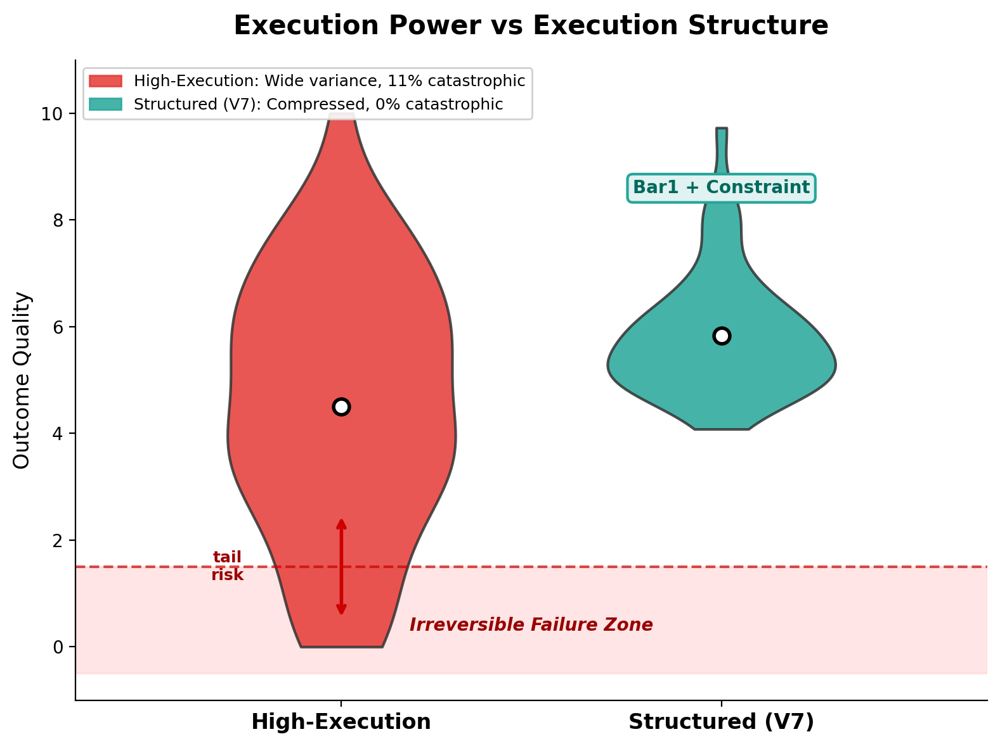
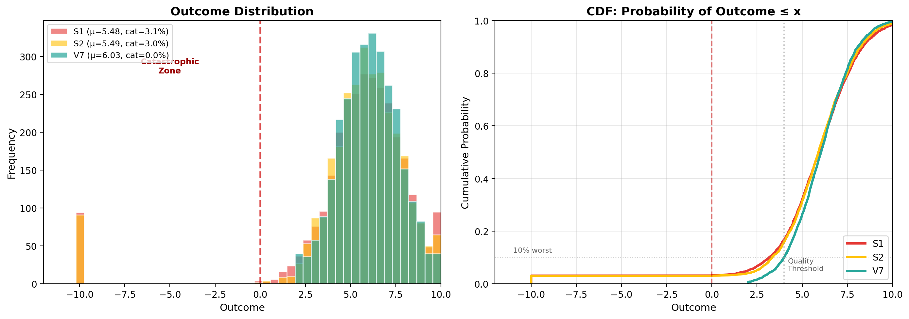
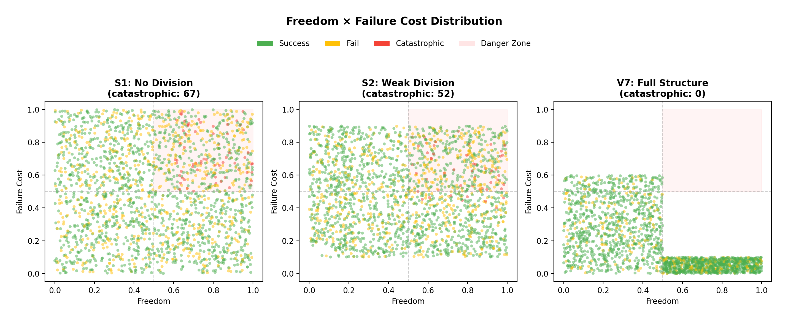

# Chat as Observation Engine
## Execution Grammar for Irreversible Systems


# Chat as Observation Engine
## Execution Grammar for Irreversible Systems

---

## 1. What This Repository Is

This repository documents a structure-first execution grammar
for irreversible systems.

It establishes one result:

> Systems fail not because they lack intelligence,
> but because irreversible action is allowed too early.

This is not an implementation guide.
This is a structural result, validated experimentally.

---
## Why This Is Not About “Smarter” or “Faster” AI

Most discussions about AI systems frame performance as a matter of capability:

- better judgment
- stronger execution
- faster optimization

This repository does **not** study that.

What we observed is simpler — and more fundamental:

> Systems fail not because judgment or execution is weak,
> but because they are **not structurally separated**.

An AI with perfect judgment will still fail
if it is allowed to execute too early.

An AI with unlimited execution power will still fail
if judgment and action are coupled.

The critical variable is not intelligence.
It is **permission**.

## Why We Built a Demo AI This Way

The systems in this repository are not optimized agents.

They do not learn.
They do not improve.
They do not compete on performance.

They exist for one purpose only:

> To demonstrate what happens
> when observation, judgment, and execution
> are either **entangled** or **structurally separated**.

The demo AI is intentionally constrained.

Not to reduce capability —
but to isolate structure.

This allows us to observe a single fact:

> Catastrophic failure disappears
> when execution is delayed
> until irreversibility is confirmed.

## 2. Core Execution Grammar (System Identity)

Execution is never decided by models.

It follows a fixed, non-negotiable pipeline:

```
STATE → Bar1 → Constraint → Δ-Plan → Execute
```


### Roles

| Stage | Function |
|-------|----------|
| **STATE** | observation only (no decision) |
| **Bar1** | irreversible confirmation boundary |
| **Constraint** | structural permission gate |
| **Δ-Plan** | bounded execution plan |
| **Execute** | action allowed only if all gates pass |

Intelligence remains free.
Action is always conditional.

---

## 3. The Irreversibility Principle (Bar1)

> Before Bar1, outcome-determining information does not exist.

Prediction before Bar1 is not wrong —
it is structurally undefined.

This is why premature execution creates catastrophic tails.

---

## 4. Chat as an Observation Engine

Chat is not an answer stream.

It is a constrained observation process.

Each turn:

- reduces uncertainty
- increases information
- does not permit action

Action becomes possible only after structure resolves.

---

## 5. Prediction vs Observation


Prediction-based systems assume:

- stable intent
- reversible error

Irreversible systems have neither.

As complexity grows:

- prediction error explodes
- failure cost dominates
- safety collapses

Observation-based systems behave differently:

- ambiguity increases signal
- structure emerges before action
- execution is delayed until risk is bounded

This is not a preference.
It is a structural necessity.

---

## 6. Simulated System Description
### (What Was Actually Tested)

All results in this repository come from a controlled simulation
of irreversible decision systems.

No real-world environment is assumed.
No learning, tuning, or adaptation is applied.

Only structural differences are tested.

### Simulation Model

Each system operates in repeated decision cycles.

At each cycle:

- an action is sampled
- with associated reward
- irreversible failure cost
- freedom (choice variance)
- structure (execution gating)

Outcome distributions contain heavy-tail risk.

### System Definitions

#### S1 — No Division

- Judgment and execution are coupled
- Immediate execution after evaluation
- High freedom × high cost allowed
- No barrier against catastrophe

#### S2 — Weak Division

- Partial constraints
- Some high-risk actions filtered
- Dangerous state space reduced, not removed

#### V7 — Full Structure

- Observation, structure, execution fully separated
- Execution allowed only after Bar1 + Constraint
- High freedom ⇒ near-zero cost
- High cost ⇒ low freedom

This eliminates the
**high-freedom × high-cost state space**.

---

## 7. What the Simulation Measures

Each run records:

| Metric | Description |
|--------|-------------|
| **Mean** | average performance |
| **Std** | instability |
| **Min** | worst-case outcome |
| **Cat%** | catastrophic failure rate |
| **Effective** | mean adjusted for tail risk |

All results are averaged over thousands of independent runs.

---

## 8. Experimental Evidence

### 8.1 Execution Power vs Execution Structure

Execution power scales variance.
Execution structure compresses variance.

High execution without structure creates catastrophic tails.



### 8.2 Outcome Distributions



### 8.3 Freedom × Failure Cost

Catastrophic failure is not random.

It appears only where:

> **High Freedom × High Irreversible Cost**

V7 removes this region by design.



### 8.4 Stress & Adversarial Validation

Under:

- cost inflation
- freedom injection
- execution spikes
- observation noise

V7 remains stable.

Catastrophe appears **only when structure is eroded**.


---

## 9. Quantitative Results

| System | Mean | Std | Min | Cat% | Effective |
|--------|------|-----|-----|------|-----------|
| S1 | 5.48 | 3.34 | -10.0 | 3.1% | 3.18 |
| S2 | 5.49 | 3.24 | -10.0 | 3.0% | 3.27 |
| **V7** | **6.03** | **1.60** | **2.0** | **0.0%** | **5.23** |

> V7 does not outperform by being smarter.
> It outperforms by eliminating bad outcomes.

---

## 10. Final Structural Claim

> V7 is not robust because it adapts to stress.
> It is robust because stress has nowhere to propagate.

> If breaking the system requires breaking the structure,
> then the structure **is** the system.

---

## 11. Repository Scope

| Aspect | Status |
|--------|--------|
| Concept | stable |
| Structure | frozen |
| Experiments | complete |
| Code | illustrative |

This repository explains **why** the system cannot fail,
not how to implement it.

---

## Closing

We do not predict outcomes.
We observe freedom collapsing into reality.

That is where action begins.

All simulations are reproducible and parameter-invariant across random seeds.