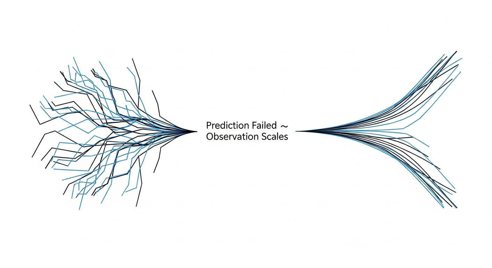
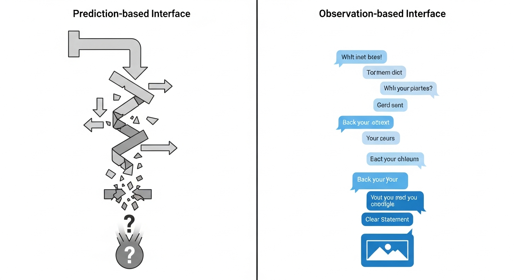
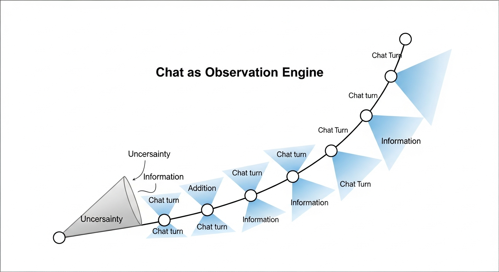
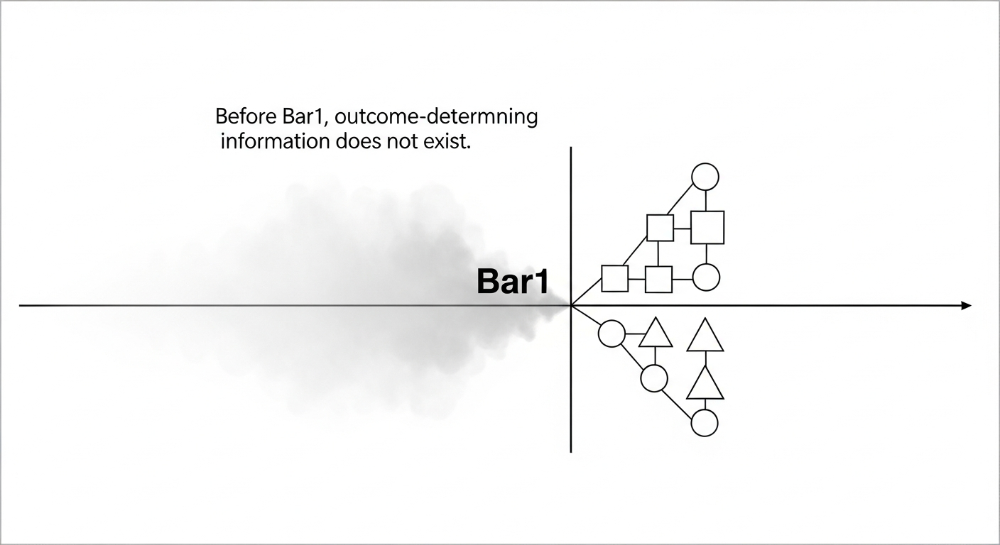
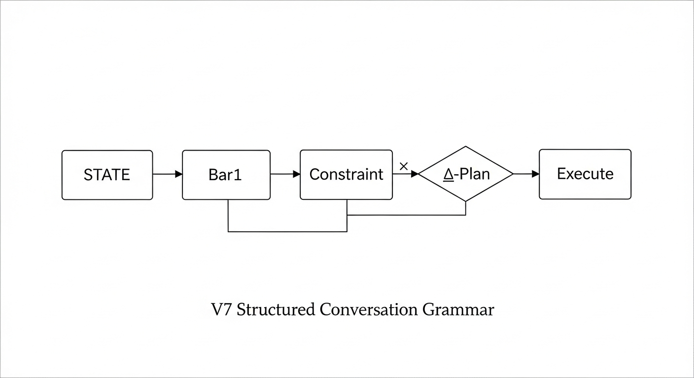

## Execution Grammar

This system does not allow models to decide actions directly.

Execution follows a fixed structural pipeline:

STATE → Bar1 → Constraint → Δ-Plan → Execute

- STATE: observation only (no decision)
- Bar1: irreversible confirmation
- Constraint: structural permission gate
- Δ-Plan: conditional action plan
- Execute: action is allowed only if all prior gates pass

Intelligence remains free.
Action is always conditional.

## Why This Direction Wins

**This is not an optimization choice.  
It is the only direction that remains stable as complexity grows.**

This direction is not chosen for convenience or trend.
It is chosen because alternatives fail structurally.

### Prediction Does Not Scale
Prediction assumes stable intent and reversible error.
In irreversible systems, neither exists.

As complexity increases:
- prediction error grows
- failure cost explodes
- safety and alignment degrade

### Observation Scales With Ambiguity
Observation-based systems wait for structure to appear.
They do not guess.

As ambiguity increases:
- form and one-shot interfaces collapse
- observation gains signal
- structured chat becomes more effective

This is confirmed empirically.

### One Mechanism, Three Wins
Delaying irreversible action until observation resolves structure
simultaneously improves:

- safety
- efficiency
- alignment

No other direction achieves all three with a single mechanism.

# Chat as Observation Engine

> **AI doesn't fail because it predicts wrong.  
> It fails because it acts when it shouldn't.**

This repository explores a **non-predictive AI interaction architecture**  
where **chat is treated as an observation process**, not a decision engine.

The core idea is simple:

> **Models think.  
> Structures decide when action is allowed.  
> Executors act.**

This is not AI restriction.  
This is **division of labor by structure**.

---

## 1. From Prediction to Observation

Traditional AI systems fail at scale not due to lack of intelligence,
but due to **unconditional action**.

Prediction-based systems attempt to collapse uncertainty *before* it resolves.

Observation-based systems wait for structure to emerge.

---

## 2. Chat as an Observation Engine

A chat is not a stream of answers.
It is a **sequence of constrained observations**.

Each turn:
- reduces uncertainty
- adds information
- but does **not** permit action by default

Action is only enabled **after structural confirmation**.

---

## 3. Why Prediction Fails but Observation Scales

Prediction explodes with branching futures.
Observation converges *after reality commits*.

> Before resolution, outcome-determining information does not exist.

---

## 4. The Bar1 Principle (Irreversibility)

Before a decisive event (Bar1),
no amount of intelligence can know the outcome.

After Bar1,
structure becomes observable.

This principle originates from market structure research,
but generalizes to **all irreversible decision systems**.

---

## 5. Observation-Based Interface Design

Prediction-based interfaces ask:
> “What will happen?”

Observation-based interfaces ask:
> “What just became true?”

Chat becomes a **state clarifier**, not a guess generator.

---

## 6. Structured Conversation Grammar (V7)

Action is gated by structure, not confidence.

STATE → Bar1 → Constraint → ΔPlan → Execute

- **STATE**: contextual classification
- **Bar1**: irreversible confirmation
- **Constraint**: admissibility filter
- **Δ-Plan**: bounded action proposal
- **Execute**: permitted action

Models never decide **when** to act.
They only operate **inside allowed structure**.

---

## 7. What This Is (and Is Not)

**This is:**
- An AI safety architecture via structure
- A non-predictive agent framework
- A generalization of irreversible systems

**This is NOT:**
- Model censorship
- Intelligence limitation
- Behavior fine-tuning

Intelligence stays free.  
**Action becomes conditional.**

---

## 8. Relation to V7 Grammar System

This work is derived from and conceptually aligned with
the V7 decision grammar developed for irreversible market systems.

---

## Status

- Concept: **stable**
- Structure: **frozen**
- Experiments: ongoing
- Code: optional

This repository documents **structure**, not implementation.

---

## Closing

> We do not predict outcomes.  
> We observe freedom collapsing into reality.

That is where action begins.
