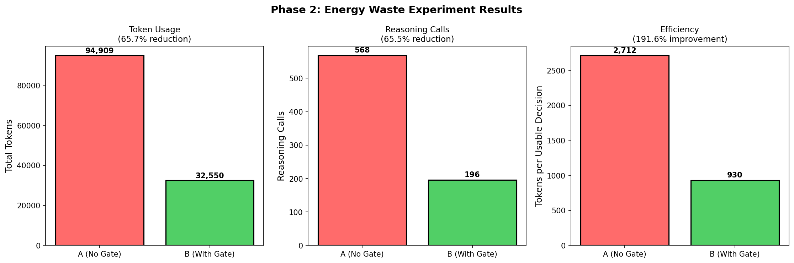
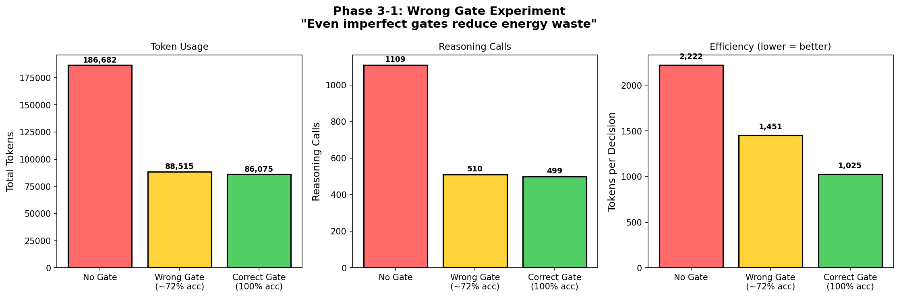
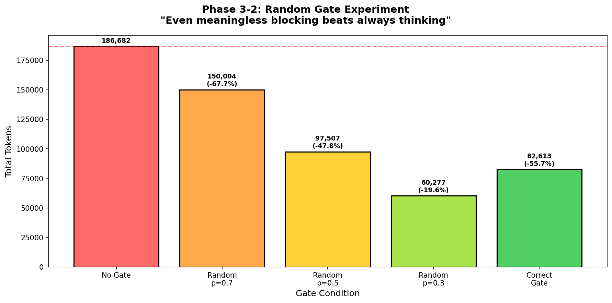
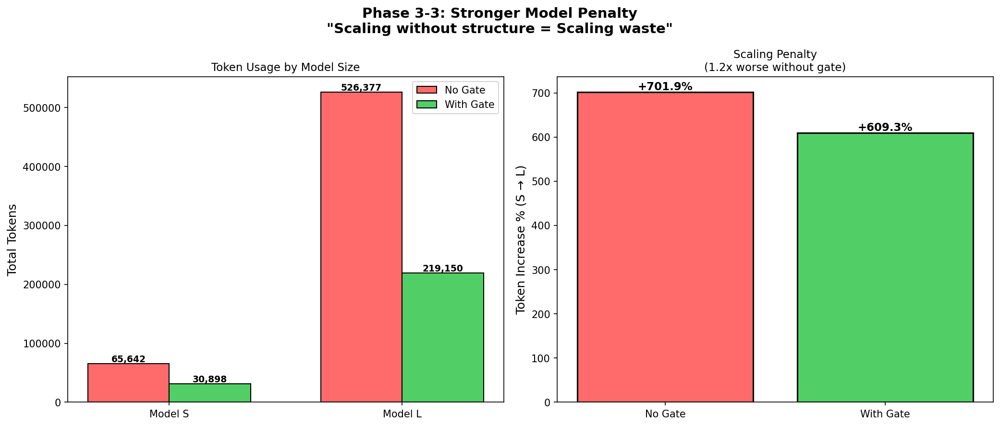
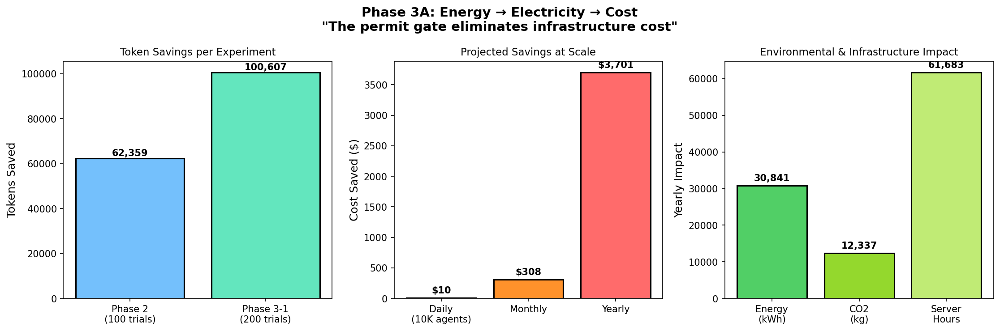

# Irreversible Energy Law of Decision Systems

> In irreversible-cost environments,  
> energy efficiency is dominated by execution permission,  
> not decision correctness.

---

## 1. Problem

Modern AI systems consume increasing energy and cost,
yet yield diminishing decision value.

This is not a model intelligence problem.
This is a **permission problem**.

---

## 2. Key Insight

Most AI energy is spent **before a decision is even allowed to exist**.

Waste is defined as:

```
Waste = Energy_spent − Information_generated
```

---

## 3. Phase 2 — Energy Waste Baseline



| Condition | Tokens | Reduction |
|-----------|--------|-----------|
| No Gate | 94,909 | — |
| With Gate | 32,550 | **65.7%** |

- Gate present → **65% energy reduction**
- Gate absent → majority of computation discarded

---

## 4. Phase 3 — Hypothesis Stress Tests

### 4.1 Wrong Gate (72% accuracy)



Even with 28% error:
- **52.6% token reduction**
- Confirms structure > correctness

---

### 4.2 Random Gate



| Condition | Tokens | Reduction |
|-----------|--------|-----------|
| No Gate | 186,682 | — |
| Random p=0.5 | 97,507 | 47.8% |
| Correct Gate | 82,613 | 55.7% |

> Meaningless blocking is cheaper than meaningless reasoning.

---

### 4.3 Stronger Model Penalty



| Model | No Gate Increase | With Gate Increase |
|-------|------------------|-------------------|
| S → L | +701.9% | +609.3% |

Scaling without structure leads to superlinear waste.

---

## 5. Energy → Cost Translation



Enterprise scale (10,000 agents/day):

| Metric | Annual Value |
|--------|-------------|
| Cost Saved | **$3,701** |
| Energy Saved | 30,841 kWh |
| CO₂ Avoided | 12,337 kg |

---

## 6. Conclusion

This establishes a system-level law:

**Irreversible Energy Law of Decision Systems**

```
Energy efficiency emerges from permission to execute,
not from decision accuracy.
```

---

## 7. Implication: A New Role

This gap defines a new system role:

### Structure Observer

A role responsible for:
- Execution permission
- Energy waste prevention
- Irreversible cost control

---

## Experimental Evidence

| Phase | Experiment | Key Finding |
|-------|------------|-------------|
| 2 | Energy Waste | Gate = 65% reduction |
| 3-1 | Wrong Gate | 72% acc still saves 52% |
| 3-2 | Random Gate | Random > Always Think |
| 3-3 | Model Scale | No Gate = 1.2x penalty |
| 3A | Cost | $3,701/year @ 10K agents |

---

*"The permit gate is not an optimization. It's infrastructure cost elimination."*
